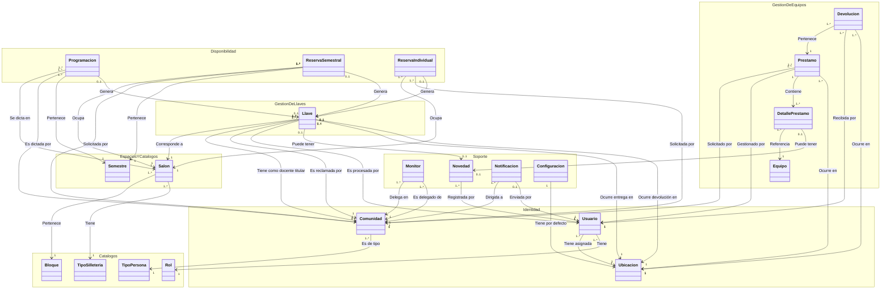

# 2.1 Modelo Dominio Anémico

Modelo de dominio de Llavero: entidades como contenedores de datos y relaciones, sin comportamiento — la lógica de negocio vive aparte, en `domain.py` de cada módulo (ver `estrategia-migracion/backend.md`), no dentro de estos objetos.

## Diagrama de dominio

Agrupado por área funcional (namespace) para que las relaciones queden legibles en vez de cruzarse entre sí.

## Objetos de dominio

- **Usuario**: Objeto de dominio que representa al personal del sistema (Administrador, Auxiliar o Portero) y su ubicación asignada.
- **Rol**: Objeto de dominio que representa los roles disponibles para el personal del sistema (Admin, Auxiliar, Portero).
- **Ubicacion**: Objeto de dominio que representa los puntos físicos de operación (oficina principal, portería superior, portería inferior).
- **Comunidad**: Objeto de dominio que representa a las personas identificables por credencial — docentes, estudiantes y empleados — sincronizadas desde el sistema institucional.
- **TipoPersona**: Objeto de dominio que representa los tipos de persona de la comunidad universitaria (docente, estudiante, empleado).
- **Bloque**: Objeto de dominio que representa un bloque o edificio de la universidad.
- **TipoSilleteria**: Objeto de dominio que representa los tipos de silletería que puede tener un salón.
- **Salon**: Objeto de dominio que representa un salón físico, con su bloque, tipo de silletería y su composición de mobiliario (sillas y/o mesas).
- **Semestre**: Objeto de dominio que representa la vigencia de un periodo académico.
- **Programacion**: Objeto de dominio que representa una clase oficial cargada desde el sistema institucional.
- **ReservaSemestral**: Objeto de dominio que representa una franja horaria recurrente semanal, no oficial, vigente durante un semestre.
- **ReservaIndividual**: Objeto de dominio que representa una reserva de salón para una fecha puntual, sujeta a aprobación.
- **Llave**: Objeto de dominio que representa un préstamo de llave de un salón, desde su entrega hasta su devolución.
- **Equipo**: Objeto de dominio que representa un equipo del inventario (videobeam, bafle, computador, cable de red, etc.).
- **Prestamo**: Objeto de dominio que representa el préstamo de uno o varios equipos a la vez.
- **DetallePrestamo**: Objeto de dominio que representa la relación entre un préstamo y cada uno de los equipos incluidos en él, con su propio estado de entrega/devolución.
- **Devolucion**: Objeto de dominio que representa un acto de devolución (parcial o completa) de los equipos de un préstamo.
- **Monitor**: Objeto de dominio que representa la delegación de permiso de un docente titular hacia un estudiante u otra persona para reclamar/entregar su llave.
- **Novedad**: Objeto de dominio que representa un daño, pérdida u observación registrada sobre una llave o un equipo.
- **Notificacion**: Objeto de dominio que representa un recordatorio o aviso —automático o manual— enviado a una persona de la comunidad.
- **Configuracion**: Objeto de dominio que representa los valores por defecto del sistema (umbral de mora, plantilla de recordatorio, ubicación por defecto).

## Diccionario de datos

### Usuario
| Campo | Tipo | Descripción | Ejemplo |
|---|---|---|---|
| id | identificador | Identificador único | `7c9e6679-7425-40de-944b-e07fc1f90ae7` |
| nombre | texto | Nombre completo | `Marcela Torres` |
| email_institucional | texto | Correo Office 365 | `mtorres@uco.edu.co` |
| oid_microsoft | texto | Identificador estable de Microsoft Entra ID — vínculo real de autenticación, no depende de que el correo no cambie | `9a8b7c6d-...` |
| rol_id | referencia | Rol asignado (FK a Rol) | `1f2e3d4c-5b6a-4798-8071-9a0b1c2d3e4f` |
| ubicacion_id | referencia | Ubicación asignada (FK a Ubicación) | `f47ac10b-58cc-4372-a567-0e02b2c3d479` |
| activo | booleano | Si la cuenta puede iniciar sesión | `true` |

### Rol
| Campo | Tipo | Descripción | Ejemplo |
|---|---|---|---|
| id | identificador | Identificador único | `1f2e3d4c-5b6a-4798-8071-9a0b1c2d3e4f` |
| nombre | texto | Nombre del rol | `auxiliar` |

### Ubicacion
| Campo | Tipo | Descripción | Ejemplo |
|---|---|---|---|
| id | identificador | Identificador único | `3fa85f64-5717-4562-b3fc-2c963f66afa6` |
| nombre | texto | Nombre visible | `Portería superior` |
| permite_prestamo_llaves | booleano | Si desde aquí se pueden entregar llaves | `true` |
| permite_devolucion_llaves | booleano | Si desde aquí se pueden recibir llaves | `true` |
| permite_prestamo_equipos | booleano | Si desde aquí se pueden entregar equipos | `false` |

### Comunidad
| Campo | Tipo | Descripción | Ejemplo |
|---|---|---|---|
| id | identificador | Identificador único | `9b1deb4d-3b7d-4bad-9bdd-2b0d7b3dcb6d` |
| numero_documento | texto | Documento de identidad | `1094882231` |
| nombre | texto | Nombre completo | `Carlos Ramírez` |
| tipo_persona_id | referencia | Tipo de persona (FK a TipoPersona) | `2a3b4c5d-6e7f-4809-9182-0b1c2d3e4f5a` |
| id_carnet | texto | Identificador de carnet, recibido en texto plano del ETL | `CAR0142` |
| correo | texto | Correo de contacto | `cramirez@uco.edu.co` |
| numero_contacto | texto | Teléfono de contacto | `311 220 5510` |
| facultad | texto | Facultad a la que pertenece | `Ingeniería` |

### TipoPersona
| Campo | Tipo | Descripción | Ejemplo |
|---|---|---|---|
| id | identificador | Identificador único | `2a3b4c5d-6e7f-4809-9182-0b1c2d3e4f5a` |
| nombre | texto | Nombre del tipo de persona | `docente` |

### Bloque
| Campo | Tipo | Descripción | Ejemplo |
|---|---|---|---|
| id | identificador | Identificador único | `1b9d6bcd-bbfd-4b2d-9b5d-ab8dfbbd4bed` |
| nombre | texto | Nombre del bloque | `Bloque A` |

### TipoSilleteria
| Campo | Tipo | Descripción | Ejemplo |
|---|---|---|---|
| id | identificador | Identificador único | `16fd2706-8baf-433b-82eb-8c7fada847da` |
| nombre | texto | Nombre del tipo de silletería | `Universitaria` |

### Salon
| Campo | Tipo | Descripción | Ejemplo |
|---|---|---|---|
| id | identificador | Identificador único | `550e8400-e29b-41d4-a716-446655440000` |
| nombre | texto | Nombre/código del salón | `A-204` |
| bloque_id | referencia | Bloque al que pertenece (FK) | `1b9d6bcd-bbfd-4b2d-9b5d-ab8dfbbd4bed` |
| tipo_silleteria_id | referencia | Tipo de silletería (FK) | `16fd2706-8baf-433b-82eb-8c7fada847da` |
| cantidad_sillas | número | Cantidad de sillas individuales del salón (0 si es de mesas) | `40` |
| cantidad_mesas | número | Cantidad de mesas del salón (0 si es de sillas individuales) | `0` |

### Semestre
| Campo | Tipo | Descripción | Ejemplo |
|---|---|---|---|
| id | identificador | Identificador único | `123e4567-e89b-12d3-a456-426614174000` |
| codigo | texto | Código del semestre | `2026-2` |
| fecha_inicio | fecha | Inicio de vigencia | `2026-07-20` |
| fecha_fin | fecha | Fin de vigencia | `2026-12-05` |

### Programacion
| Campo | Tipo | Descripción | Ejemplo |
|---|---|---|---|
| id | identificador | Identificador único | `e8f9a0b1-c2d3-4e4f-8a9b-0c1d2e3f4a5b` |
| salon_id | referencia | Salón donde se dicta (FK) | `550e8400-e29b-41d4-a716-446655440000` |
| docente_id | referencia | Docente asignado (FK a Comunidad) | `9b1deb4d-3b7d-4bad-9bdd-2b0d7b3dcb6d` |
| semestre_id | referencia | Semestre al que pertenece (FK) | `123e4567-e89b-12d3-a456-426614174000` |
| dia | enum | Día de la semana | `lunes` |
| hora_inicio / hora_fin | hora | Franja horaria | `07:00` / `09:00` |
| materia | texto | Nombre de la materia | `Ingeniería de Software` |

### ReservaSemestral
| Campo | Tipo | Descripción | Ejemplo |
|---|---|---|---|
| id | identificador | Identificador único | `f9a0b1c2-d3e4-4f5a-9b0c-1d2e3f4a5b6c` |
| salon_id | referencia | Salón ocupado (FK) | `550e8400-e29b-41d4-a716-446655440001` |
| solicitante_id | referencia | Persona solicitante (FK a Comunidad) | `6ba7b810-9dad-11d1-80b4-00c04fd430c8` |
| semestre_id | referencia | Semestre al que pertenece (FK) | `123e4567-e89b-12d3-a456-426614174000` |
| dia | enum | Día de la semana | `jueves` |
| hora_inicio / hora_fin | hora | Franja horaria recurrente | `09:00` / `12:00` |
| grupo_id | identificador | Agrupa las franjas de una misma solicitud | `a1b2c3d4-e5f6-4a7b-8c9d-0e1f2a3b4c5d` |
| creado_manualmente | booleano | Si se puede cancelar desde la UI (vs. carga institucional) | `true` |

### ReservaIndividual
| Campo | Tipo | Descripción | Ejemplo |
|---|---|---|---|
| id | identificador | Identificador único | `a0b1c2d3-e4f5-4a6b-8c0d-2e3f4a5b6c7d` |
| salon_id | referencia | Salón solicitado (FK) | `550e8400-e29b-41d4-a716-446655440002` |
| solicitante_id | referencia | Persona solicitante (FK a Comunidad) | `6ba7b811-9dad-11d1-80b4-00c04fd430c8` |
| fecha | fecha | Fecha puntual de la reserva | `2026-08-15` |
| hora_inicio / hora_fin | hora | Franja horaria | `10:00` / `12:00` |
| motivo | texto | Para qué se solicita el salón | `Charla de egresados` |
| estado | enum | `aprobada` / `cancelada` / `completada` (se reclamó la llave) / `no_reclamada` — se aprueba al crearse, no hay paso de aprobación manual | `aprobada` |

### Llave
| Campo | Tipo | Descripción | Ejemplo |
|---|---|---|---|
| id | identificador | Identificador único | `b1c2d3e4-f5a6-4b7c-9d0e-3f4a5b6c7d8e` |
| salon_id | referencia | Salón al que corresponde (FK) | `550e8400-e29b-41d4-a716-446655440000` |
| docente_titular_id | referencia | Docente dueño de la clase (FK a Comunidad) | `9b1deb4d-3b7d-4bad-9bdd-2b0d7b3dcb6d` |
| reclamado_por_id | referencia | Quién físicamente la reclamó — el mismo docente titular, o un monitor delegado (FK a Comunidad) | `9b1deb4d-3b7d-4bad-9bdd-2b0d7b3dcb6d` |
| origen | enum | `programacion` / `reserva_semestral` / `reserva_individual` / `manual` — de dónde vino la entrega | `programacion` |
| tipo_entrega | enum | `credencial` / `manual` | `credencial` |
| tipo_devolucion | enum | `credencial` / `manual` (nulo hasta que ocurra) | `credencial` |
| usuario_entrega_id | referencia | Quién la entregó (FK a Usuario) | `7c9e6679-7425-40de-944b-e07fc1f90ae7` |
| usuario_recibe_id | referencia | Quién la recibió al devolverse (FK a Usuario) | `7c9e6679-7425-40de-944b-e07fc1f90ae7` |
| ubicacion_entrega_id | referencia | Dónde ocurrió la entrega (FK a Ubicación) — se guarda en el momento, no se infiere de la ubicación actual del usuario | `3fa85f64-5717-4562-b3fc-2c963f66afa6` |
| ubicacion_devolucion_id | referencia | Dónde ocurrió la devolución (FK a Ubicación, nulo hasta que ocurra) | `f47ac10b-58cc-4372-a567-0e02b2c3d479` |
| novedad_id | referencia | Novedad adjunta al devolver, si la hay (FK a Novedad, nulo si no hay novedad) | `null` |
| fecha_hora_entrega | fecha/hora | Momento de entrega | `2026-08-07 07:02` |
| fecha_hora_devolucion | fecha/hora | Momento de devolución (nulo hasta que ocurra) | `2026-08-07 09:05` |
| estado | enum | `en_prestamo` / `demora_entrega` (pasó el límite configurado para esa llave) / `entregado` | `en_prestamo` |

### Equipo
| Campo | Tipo | Descripción | Ejemplo |
|---|---|---|---|
| id | identificador | Identificador único | `c2d3e4f5-a6b7-4c8d-9e0f-4a5b6c7d8e9f` |
| nombre | texto | Nombre del equipo | `Videobeam Epson` |
| marca | texto | Marca | `Epson` |
| codigo_inventario | texto | Código de inventario institucional | `INV-014` |
| codigo_barras | texto | Código de barras físico | `EQ-014` |
| estado | enum | `activo` / `inactivo` | `activo` |

### Prestamo
| Campo | Tipo | Descripción | Ejemplo |
|---|---|---|---|
| id | identificador | Identificador único | `d3e4f5a6-b7c8-4d9e-8f0a-5b6c7d8e9f0a` |
| solicitante_id | referencia | Persona que recibe los equipos (FK a Comunidad) | `6ba7b812-9dad-11d1-80b4-00c04fd430c8` |
| usuario_prestamista_id | referencia | Quién entregó (FK a Usuario) | `7c9e6679-7425-40de-944b-e07fc1f90ae7` |
| ubicacion_id | referencia | Dónde ocurrió la entrega (FK a Ubicación) | `f47ac10b-58cc-4372-a567-0e02b2c3d479` |
| estado | enum | `activo` / `parcialmente_devuelto` / `completamente_devuelto` | `parcialmente_devuelto` |
| fecha_creacion | fecha/hora | Momento del préstamo | `2026-08-07 08:40` |

### DetallePrestamo
| Campo | Tipo | Descripción | Ejemplo |
|---|---|---|---|
| id | identificador | Identificador único | `e4f5a6b7-c8d9-4e0f-9a1b-6c7d8e9f0a1b` |
| prestamo_id | referencia | Préstamo al que pertenece (FK) | `d3e4f5a6-b7c8-4d9e-8f0a-5b6c7d8e9f0a` |
| equipo_id | referencia | Equipo prestado (FK) | `c2d3e4f5-a6b7-4c8d-9e0f-4a5b6c7d8e9f` |
| estado_equipo | enum | `entregado` / `devuelto` | `entregado` |
| novedad_id | referencia | Novedad adjunta al devolver este equipo, si la hay (FK a Novedad, nulo si no hay novedad) | `null` |
| fecha_entrega | fecha/hora | Cuándo se entregó ese equipo específico | `2026-08-07 08:40` |
| fecha_devolucion | fecha/hora | Cuándo se devolvió (nulo hasta que ocurra) | `null` |

### Devolucion
| Campo | Tipo | Descripción | Ejemplo |
|---|---|---|---|
| id | identificador | Identificador único | `f5a6b7c8-d9e0-4f1a-8b2c-7d8e9f0a1b2c` |
| prestamo_id | referencia | Préstamo al que corresponde (FK) | `d3e4f5a6-b7c8-4d9e-8f0a-5b6c7d8e9f0a` |
| usuario_recibe_id | referencia | Quién recibió la devolución (FK a Usuario) | `7c9e6679-7425-40de-944b-e07fc1f90ae7` |
| ubicacion_id | referencia | Dónde ocurrió la devolución (FK a Ubicación) | `3fa85f64-5717-4562-b3fc-2c963f66afa6` |
| fecha | fecha/hora | Momento de la devolución | `2026-08-07 11:15` |
| es_completa | booleano | Si esta devolución cerró el préstamo por completo | `false` |

### Monitor
**Confirmado**: la delegación se acota a una clase puntual (aula+día+horario), no a toda la materia — así evita que un monitor delegado para una sección quede con acceso a otras secciones de la misma materia del mismo docente, y permite que la resolución automática de NFC verifique el permiso contra la misma `Programacion`/`ReservaSemestral` exacta que generó la llave, sin ambigüedad.

| Campo | Tipo | Descripción | Ejemplo |
|---|---|---|---|
| id | identificador | Identificador único | `a6b7c8d9-e0f1-4a2b-9c3d-8e9f0a1b2c3d` |
| docente_titular_id | referencia | Docente que delega (FK a Comunidad) | `9b1deb4d-3b7d-4bad-9bdd-2b0d7b3dcb6d` |
| monitor_delegado_id | referencia | Persona delegada (FK a Comunidad) | `de305d54-75b4-431b-adb2-eb6b9e546013` |
| materia | texto | Materia asociada a la delegación | `Ingeniería de Software` |
| aula | texto | Aula específica a la que aplica la delegación | `A-204` |
| dia | enum | Día de la semana en que aplica | `lunes` |
| horario | texto | Franja horaria específica en que aplica | `07:00 - 09:00` |
| activo | booleano | Si la delegación sigue vigente | `true` |

### Novedad
| Campo | Tipo | Descripción | Ejemplo |
|---|---|---|---|
| id | identificador | Identificador único | `b7c8d9e0-f1a2-4b3c-8d4e-9f0a1b2c3d4e` |
| categoria | enum | `dano` / `perdida` / `otro` | `dano` |
| descripcion | texto | Detalle de la novedad | `Pantalla del videobeam con manchas` |
| estado | enum | `abierta` / `cerrada` | `abierta` |
| solucion | texto | Definida exclusivamente por Administrador | `Enviado a mantenimiento` |
| registrado_por_id | referencia | Quién la registró (FK a Usuario) | `7c9e6679-7425-40de-944b-e07fc1f90ae7` |

### Notificacion
| Campo | Tipo | Descripción | Ejemplo |
|---|---|---|---|
| id | identificador | Identificador único | `c8d9e0f1-a2b3-4c4d-9e5f-0a1b2c3d4e5f` |
| destinatario_id | referencia | Persona notificada (FK a Comunidad) | `9b1deb4d-3b7d-4bad-9bdd-2b0d7b3dcb6d` |
| tipo | enum | `recordatorio` / `vencimiento` / `manual` | `recordatorio` |
| asunto / mensaje | texto | Contenido enviado | `Recordatorio de devolución de llave` |
| estado_envio | enum | `enviado` / `fallido` | `enviado` |
| enviado_por_id | referencia | Quién lo envió manualmente (FK a Usuario, nulo si fue automático) | `null` |

### Configuracion
| Campo | Tipo | Descripción | Ejemplo |
|---|---|---|---|
| id | identificador | Identificador único | `d9e0f1a2-b3c4-4d5e-8f60-1a2b3c4d5e6f` |
| limite_antes_mora_minutos | número | Minutos desde la entrega antes de pasar a `demora_entrega` | `120` |
| max_reintentos_recordatorio | número | Tope de recordatorios automáticos antes de dejar de enviar | `3` |
| plantilla_recordatorio | texto | Mensaje base de los recordatorios automáticos | `Recordatorio: tienes una llave/equipo pendiente de devolver en {aula}.` |
| ubicacion_defecto_id | referencia | Ubicación preseleccionada por defecto en formularios (FK a Ubicación) | `f47ac10b-58cc-4372-a567-0e02b2c3d479` |

---

[Volver](../README.md)
