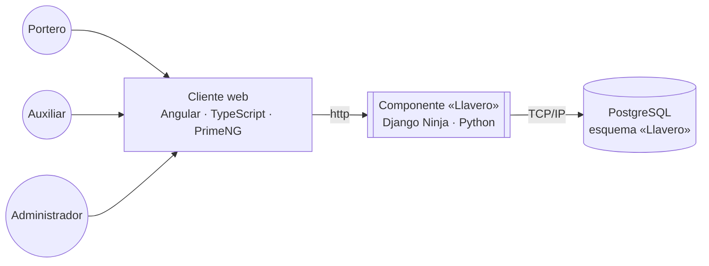

# 3.1 Arquitectura de Referencia

## Diagrama

## Explicación del diagrama

Los tres roles del sistema (**Portero**, **Auxiliar**, **Administrador**) interactúan con Llavero exclusivamente a través del navegador, donde corre el **cliente web** construido en Angular + TypeScript, con PrimeNG como librería de componentes (ver `estrategia-migracion/frontend.md`).

El cliente se comunica por **HTTP** con el **componente `Llavero`**, el backend construido en Django Ninja (Python), que expone la API REST y concentra toda la lógica de negocio siguiendo la convención de monolito modular de 5 capas (`model` / `repository` / `domain` / `service` / `controller`) definida en `estrategia-migracion/backend.md`.

El componente `Llavero` persiste sus datos en **PostgreSQL** por **TCP/IP**, en un esquema propio. No hay ningún cliente (ni el navegador, ni ningún otro componente) que hable directamente con la base de datos — todo pasa por el backend, consistente con la regla de que ningún módulo ni capa externa accede al modelo/repositorio directamente.

No aparece el ESP32 ni ningún dispositivo de red en este diagrama: el lector de credencial es un dispositivo **USB local del propio puesto de trabajo**, que entrega el valor leído directamente al campo con foco del navegador — no es un nodo de red aparte, es parte del "Cliente web" (ver `estrategia-migracion/hardware-lectura.md`).

## Drivers Arquitectónicos

Las fuerzas que moldearon las decisiones de arquitectura de Llavero:

| Driver | Por qué importa aquí |
|---|---|
| **Integridad de datos bajo concurrencia** | Varias personas (Porteros, Auxiliares) entregan/reciben llaves y equipos en simultáneo desde distintos puestos — sin transacciones e integridad referencial reales, el riesgo de doble préstamo del mismo recurso físico es real (era el hallazgo de mayor severidad de la auditoría del sistema actual). |
| **Simplicidad operativa** | El equipo que construye y opera Llavero no necesita (ni se beneficia de) la complejidad de microservicios, tiempo real, o firmware propio — cada pieza de complejidad debe ganarse su lugar. |
| **Identidad centralizada y confiable** | Todo el personal ya tiene cuenta institucional Office 365 — reautenticar con usuario/contraseña propio es una superficie de riesgo y mantenimiento innecesaria. |
| **Trazabilidad operativa** | Quien entrega, quien recibe, dónde y cuándo debe quedar registrado de forma consistente — no como un efecto secundario opcional. |
| **Testabilidad desde el primer módulo** | El sistema actual tiene cero cobertura de tests; la arquitectura nueva debe hacer que escribir tests sea el camino fácil, no una fricción adicional (de ahí el modelo de dominio anémico con `domain.py` puro, ver `2.1 Modelo Dominio Anémico.md`). |
| **Consistencia de experiencia entre roles** | Tres roles con permisos muy distintos (Admin, Auxiliar, Portero) deben sentir una sola aplicación coherente, no un mosaico de pantallas con comportamientos distintos. |

## Justificación de las Herramientas Elegidas

| Herramienta | Justificación |
|---|---|
| **PostgreSQL** | Transacciones ACID e integridad referencial real — resuelve directamente el riesgo de concurrencia y el problema de catálogos relacionados por texto plano sin FK que tenía el sistema actual. |
| **Django Ninja** | Framework maduro (ORM, migraciones, ecosistema) con tipado y rendimiento cercano a frameworks async modernos — permite la convención de 5 capas sin pelear contra el framework. |
| **Angular** | Framework SPA robusto con TypeScript nativo, adecuado para una aplicación empresarial de uso diario y prolongado, no un sitio de contenido. |
| **PrimeNG** | Librería de componentes que reemplaza el kit UI hecho a mano del sistema actual — da consistencia visual de fábrica y resuelve de paso el bug de paginación en memoria del historial de llaves. |
| **TanStack Query** | El sistema actual ya usa React Query para cache/invalidación de servidor con buen resultado — TanStack Query for Angular porta ese mismo patrón validado, sin reinventar la gestión de cache. |
| **Office 365 / Microsoft Entra ID (Authorization Code)** | La universidad ya opera Office 365 institucionalmente — aprovechar ese SSO existente evita mantener un sistema de autenticación propio y sus riesgos asociados. |
| **Lector USB genérico (HID/keyboard-wedge)** | Elimina el firmware propio del ESP32 y su canal de red dedicado — hardware genérico, de bajo costo, sin superficie de mantenimiento de firmware. |

## Justificación de Alternativa de Solución

Alternativas reales que se consideraron y se descartaron explícitamente, con la razón:

| Alternativa descartada | Por qué se descartó |
|---|---|
| **Mantener MongoDB** | Sin integridad referencial real ni transacciones consistentes en las operaciones críticas (préstamo de llaves) — es la causa raíz del riesgo de concurrencia más grave encontrado en la auditoría. |
| **Modelo de dominio rico (DDD táctico con entidades con comportamiento)** | Mayor complejidad de diseño sin beneficio real para el tamaño del problema (reglas de cálculo y decisión sobre datos, no comportamiento con identidad propia) — ver justificación completa en `2.1 Modelo Dominio Anémico.md`. |
| **Mantener tiempo real (Socket.io/WebSockets)** | Verificado en el código que solo existía para coordinar un lector NFC físico compartido — con el lector USB nuevo (uno por puesto) ese problema desaparece, y no hay ningún otro caso de uso real de tiempo real en el sistema. |
| **Mantener el ESP32 como lector dedicado** | Firmware propio que mantener, canal de red adicional, autenticación de dispositivo compartida (riesgo de seguridad) — un lector USB genérico por puesto resuelve lo mismo con menos piezas móviles. |
| **Migrar los datos históricos del sistema actual** | El sistema arranca desde cero; no había necesidad real de preservar el histórico de préstamos, y evitar la migración simplifica enormemente el corte (sin estrategia de convivencia entre Mongo y Postgres). |
| **Arquitectura de microservicios** | El alcance y el tamaño del equipo no justifican la complejidad operativa adicional (despliegues independientes, comunicación entre servicios, observabilidad distribuida) frente a un monolito modular con límites de módulo ya disciplinados por convención de capas. |

---

[Volver](../README.md)
