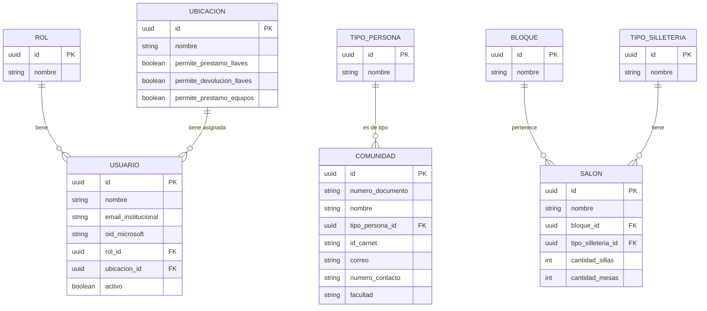
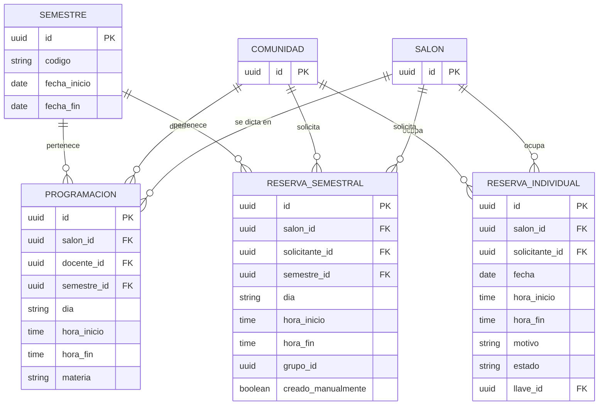
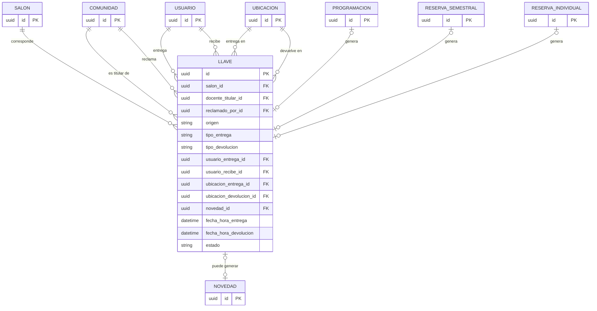
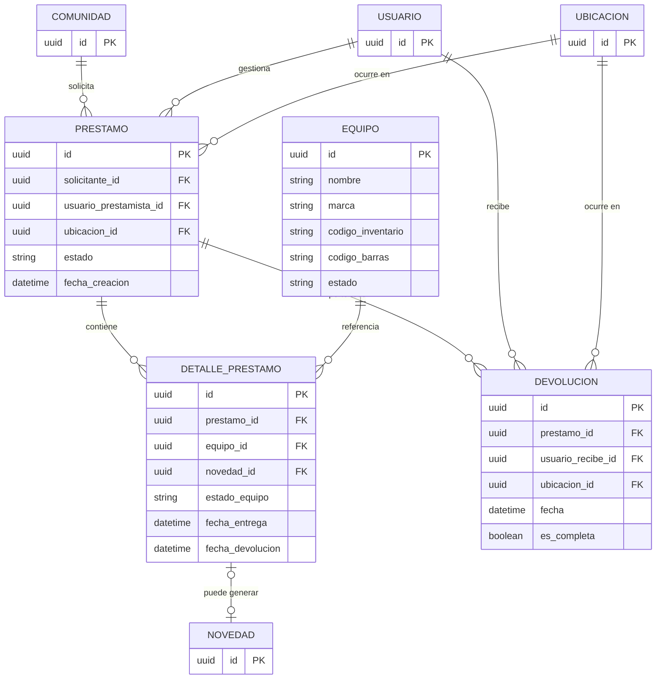
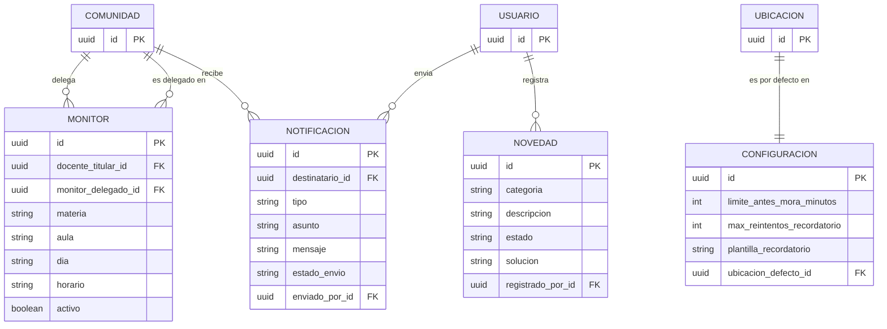

# 4.1 Modelo de Datos

Modelo entidad-relación (MER) de Llavero sobre PostgreSQL — mismas 20 entidades del modelo de dominio (`2.1 Modelo Dominio Anémico.md`), ahora con claves primarias/foráneas explícitas y cardinalidad real de base de datos. Dividido en 5 diagramas por área funcional para que sean legibles; las entidades compartidas (`Usuario`, `Comunidad`, `Ubicacion`, `Salon`) se declaran completas una sola vez y se referencian en los demás diagramas solo para mostrar la relación.

DDL completo: [`4.5 DDL.sql`](./4.5%20DDL.sql). Las claves primarias son `UUID`, pero el valor lo genera el backend (Django: `UUIDField(default=uuid.uuid4)`) antes del INSERT, no la base de datos.

## Identidad, catálogos y espacios

## Disponibilidad de salón

`llave_id` es nullable: se completa cuando el check-in NFC de la reserva entrega la llave asociada (ver [4.5 DDL.sql](./4.5%20DDL.sql)).

## Llaves

## Equipos

## Soporte

## Explicación de cada entidad

**Rol** — Catálogo cerrado de 3 filas (`admin`, `auxiliar`, `portero`). Normalizado como tabla en vez de enum para no repetir la lista de valores válidos en cada capa del sistema.

**Usuario** — Cuenta de una persona del personal (Admin, Auxiliar o Portero). Se precrea con `rol_id` y `ubicacion_id` ya asignados; el login por Office 365 solo la vincula por `email_institucional`/`oid_microsoft`, no la crea. `activo=false` revoca el acceso sin borrar el histórico de lo que esa persona procesó.

**Ubicacion** — Los puntos físicos de operación (oficina principal, porterías). Los tres `permite_*` booleanos existen porque no todas las ubicaciones habilitan las mismas operaciones (ej. una portería puede no estar habilitada para préstamo de equipos).

**TipoPersona** — Catálogo cerrado (`docente`, `estudiante`, `empleado`) para clasificar a `Comunidad`.

**Comunidad** — Docentes, estudiantes y empleados, sincronizados por el ETL institucional (no se editan a mano en Llavero). `id_carnet` es lo que identifica a la persona cuando pasa su credencial por el lector.

**Bloque** / **TipoSilleteria** — Catálogos simples de apoyo a `Salon`.

**Salon** — Un espacio físico reservable. `cantidad_sillas`/`cantidad_mesas` reemplazan un único número de "capacidad" porque el mobiliario puede ser de sillas individuales, de mesas, o una combinación.

**Semestre** — Delimita la vigencia de `Programacion` y `ReservaSemestral` — ambas existen solo dentro de un rango de fechas activo.

**Programacion** — Una clase oficial cargada por Excel institucional. Es, junto con `ReservaSemestral`, una de las dos fuentes que pueden **generar** una `Llave` automáticamente cuando el docente pasa su credencial.

**ReservaSemestral** — Una franja recurrente semanal no oficial (un semillero, un club). Comparte estructura con `Programacion` (mismo `salon_id`/`dia`/`hora_inicio`/`hora_fin`) pero es una tabla separada — no comparten almacenamiento físico (decisión ya tomada en `estrategia-migracion/backend.md` para no romper el aislamiento de monolito modular). `grupo_id` agrupa las franjas creadas en una misma solicitud, para poder cancelarlas juntas.

**ReservaIndividual** — Una reserva de fecha puntual. Se aprueba sola al crearse (`estado` nunca pasa por un paso de aprobación manual) y puede generar una `Llave` igual que `Programacion`/`ReservaSemestral`.

**Llave** — La entidad más cargada de reglas de negocio. `docente_titular_id` es el dueño de la clase; `reclamado_por_id` es quien físicamente se llevó la llave (puede ser el mismo docente o un `Monitor` delegado — de ahí que sean dos campos, no uno). `origen` deja trazabilidad de cuál de las 3 fuentes de disponibilidad generó la entrega (o si fue manual). `ubicacion_entrega_id`/`ubicacion_devolucion_id` son una fotografía del momento — no se recalculan desde la ubicación actual del `Usuario`, porque esa puede cambiar después.

**Equipo** — Un ítem de inventario individual (un videobeam específico, no "los videobeams").

**Prestamo** — El préstamo de uno o varios `Equipo` a la vez, a diferencia de `Llave` (que es siempre un solo salón). Por eso `Prestamo` no tiene un único equipo asociado directamente — eso vive en `DetallePrestamo`.

**DetallePrestamo** — Un renglón por cada equipo dentro de un préstamo, con su propio estado de entrega/devolución. Es lo que permite la devolución **parcial**: un préstamo puede tener 2 de 3 equipos ya devueltos sin que el préstamo completo se cierre.

**Devolucion** — Un acto de devolución (puede haber varios por `Prestamo` si la devolución fue parcial en distintos momentos). `es_completa` marca si esa devolución en particular cerró todo el préstamo.

**Monitor** — La delegación de un docente titular hacia otra persona para reclamar/entregar su llave en su nombre. Acotada a `materia`+`aula`+`dia`+`horario` (una clase puntual), no a todas las clases del docente — para no sobre-otorgar acceso cuando el mismo docente dicta la misma materia en varias secciones.

**Novedad** — Un daño, pérdida u observación, asociada desde `Llave` o `DetallePrestamo` (la relación vive del lado de quien la generó, no al revés). `solucion` solo la puede definir Administrador; Auxiliar puede ver y cerrar (`estado`) pero no definirla.

**Notificacion** — Un recordatorio o aviso, automático o manual. `enviado_por_id` nulo significa que lo mandó el sistema solo; si tiene valor, fue un envío manual de Admin o Auxiliar.

**Configuracion** — Fila única (o pocas filas, si se quisiera por bloque) con los valores por defecto del sistema: umbral de mora, reintentos, plantilla de recordatorio y ubicación preseleccionada en formularios.

---

[Volver](../README.md)
