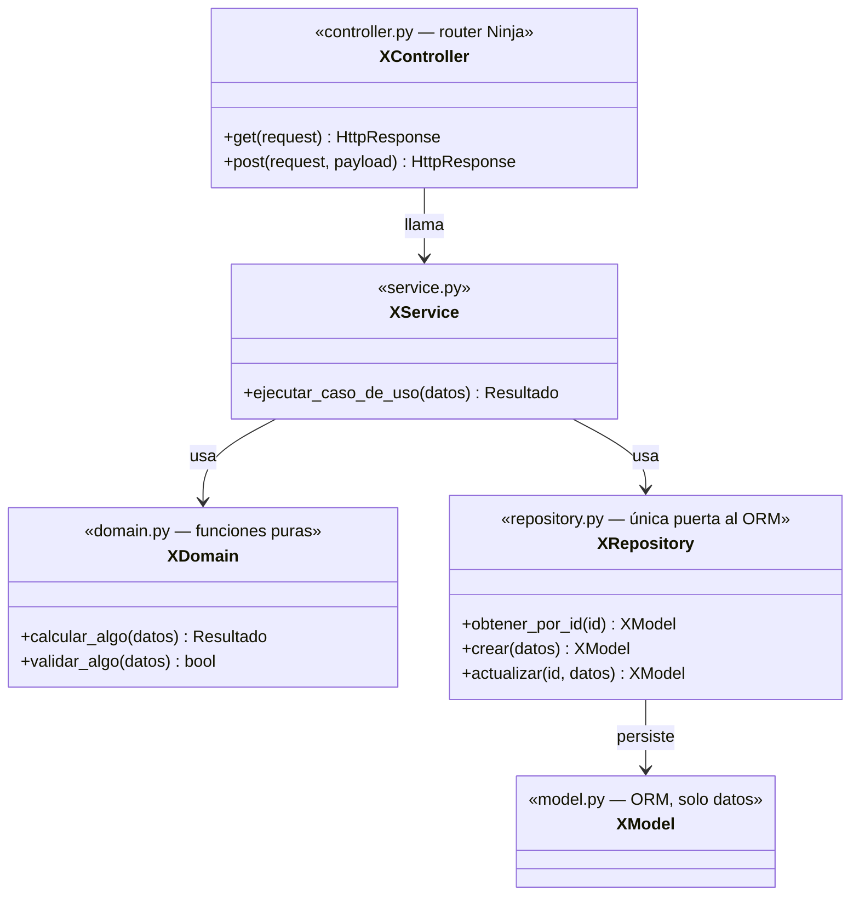
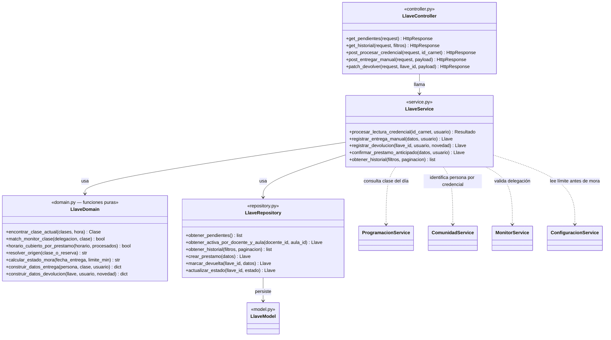

# 4.2 Diagrama de clases

Este diagrama es distinto al de `2.1 Modelo Dominio Anémico.md`: aquel mostraba **datos y relaciones**; este muestra **clases de código y sus operaciones**, siguiendo la convención de 5 capas por módulo ya decidida en `estrategia-migracion/backend.md`. Todos los módulos de Llavero repiten el mismo patrón — aquí se muestra primero el patrón genérico, y luego un ejemplo real y completo con el módulo `llaves`.

## Patrón genérico (se repite en los 15 módulos)

**Regla dura** (ya establecida): `XController` nunca llama a `XDomain` ni a `XRepository` directamente — todo pasa por `XService`, que es la única API pública del módulo hacia otros módulos también.

## Ejemplo real: módulo `llaves`

Basado en los métodos que ya existen y funcionan en el sistema actual (`llave.domain.js`, `llave.service.js`, `programacion.service.js`), traducidos a la convención nueva e incorporando las decisiones ya tomadas (`origen`, `docente_titular_id`/`reclamado_por_id`, `tipo_entrega`, ubicación como fotografía).

Las flechas punteadas (`..>`) al final son las únicas conexiones permitidas hacia otros módulos — siempre contra el `Service` del módulo ajeno, nunca contra su `Repository` ni su `Model` (regla dura de `backend.md`).

### Qué hace cada capa aquí, en concreto

- **`LlaveDomain`**: es donde vive la lógica que hoy resuelve, sin tocar la base de datos, si un tap de credencial es una entrega o una devolución, si un monitor delegado coincide con la clase que se está reclamando, y si el préstamo ya pasó el límite configurado de mora. Al ser funciones puras, se prueban con datos de entrada/salida simples, sin mockear Postgres — es la pieza que primero se cubre con TDD.
- **`LlaveService`**: orquesta — llama a `ProgramacionService`/`ComunidadService`/`MonitorService`/`ConfiguracionService` (nunca a sus modelos directamente) para reunir los datos que `LlaveDomain` necesita, y envuelve la escritura final en `transaction.atomic()` para que crear el préstamo sea una operación indivisible.
- **`LlaveRepository`**: los únicos métodos que tocan el ORM de `LlaveModel`. Nótese que no hay un `find()` genérico — cada método dice qué resuelve (`obtener_activa_por_docente_y_aula`, no `findOne(filtro)`).

---

[Volver](../README.md)
