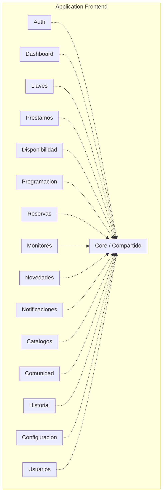
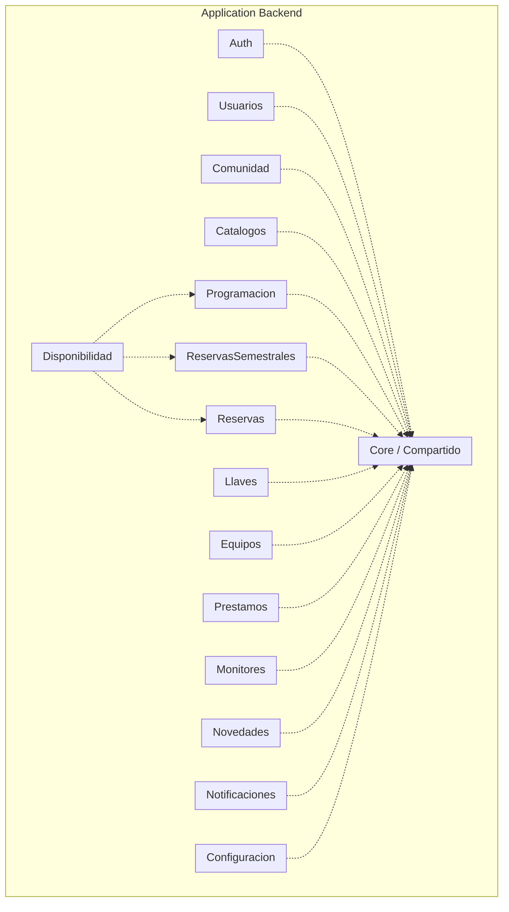

# 4.3 Diagrama de Paquetes

## Descripción de Paquetes de la Arquitectura para el Frontend

Cada vista real de Llavero es su propio paquete de features (`estrategia-migracion/frontend.md`: "Feature module o standalone components por dominio, con su servicio de datos co-localizado"). Todos dependen de un único paquete `Core / Compartido` — nunca al revés, y nunca un paquete de feature depende de otro paquete de feature directamente.

## Qué contiene cada paquete

Los 15 paquetes de feature siguen todos la misma forma interna: una página/componente Angular + su servicio de datos (llamadas HTTP vía TanStack Query) co-localizados en la misma carpeta — no hay una capa "vista" separada de una capa "datos" dentro de cada feature, viven juntos porque cambian juntos.

**`Core / Compartido`** es el único paquete del que todos dependen, y agrupa lo que ya decidimos que no debía repetirse en cada feature:

- **`AuthService`** — sesión (signals), interceptor HTTP que adjunta el bearer token y deduplica refresh concurrente (`frontend.md`).
- **`BusquedaPersonaService`** — la búsqueda por documento/carnet/credencial que hoy está duplicada en 4 páginas del sistema actual; en Llavero es un único servicio compartido.
- **Cliente HTTP / configuración de TanStack Query** — `queryKey`, invalidación y polling centralizados.
- **Componentes PrimeNG reutilizables** — envoltorios propios sobre PrimeNG donde hace falta (ej. el campo de lectura de credencial con foco automático, el indicador `p-knob` de mora).

## Regla dura (frontend)

Ningún paquete de feature importa código de otro paquete de feature directamente (ej. `Llaves` no importa nada de `Prestamos`) — si dos features necesitan compartir algo, ese algo sube a `Core`, no se referencia cruzado entre features. Es el mismo principio de aislamiento por capas que ya aplicamos en el backend (`service.py` como única API pública de un módulo), llevado al frontend.

## Descripción de Paquetes de la Arquitectura para el Backend

Cada paquete es una app de Django (`estrategia-migracion/backend.md`), con sus 5 capas internas (`model` / `repository` / `domain` / `service` / `controller`) ya definidas en `4.2 Diagrama de clases.md`. Igual que en el frontend, todos dependen de un único paquete `Core / Compartido` — con una única excepción marcada abajo (`Disponibilidad`).

**`Core / Compartido`** en el backend agrupa lo transversal a los 14 módulos:

- **Modelo base** — mixin de `id` UUID + timestamps que todos los modelos heredan.
- **Autenticación** — validación de token de Office 365 contra el JWKS de Microsoft, emisión y verificación del JWT propio (`django-ninja-jwt`).
- **Manejo de errores estándar** — la clase de error de API y su traducción a respuesta HTTP, reutilizada por todos los `controller.py`.
- **Utilidades de paginación** — usadas por cualquier `repository.py` que devuelva listas largas (ej. historial de llaves).

**`Disponibilidad` es la única excepción a "todos dependen solo de Core".** No es dueña de ningún dato propio — es un agregador de solo lectura que valida conflictos de horario consultando `Programacion`, `ReservasSemestrales` y `Reservas` a través de sus respectivos `service.py` (nunca sus modelos), tal como se decidió en `estrategia-migracion/backend.md`. Es la implementación real del calendario de disponibilidad compartido.

## Regla dura (backend)

Ningún módulo importa el `model.py` ni el `repository.py` de otro módulo — solo su `service.py` (regla ya establecida en `estrategia-migracion/backend.md` y repetida en `4.2 Diagrama de clases.md`). `Disponibilidad` respeta esta regla: depende de tres módulos hermanos, pero siempre a través de sus `service.py`, nunca accediendo a `Programacion`/`ReservasSemestrales`/`Reservas` por debajo.

---

[Volver](../README.md)
