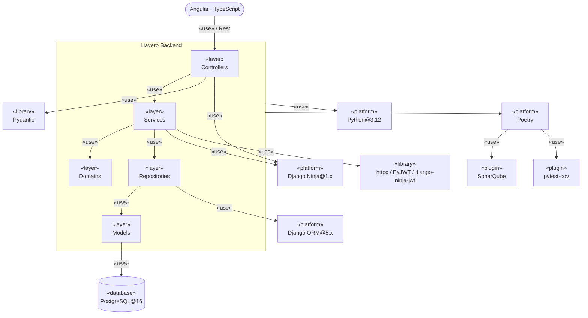
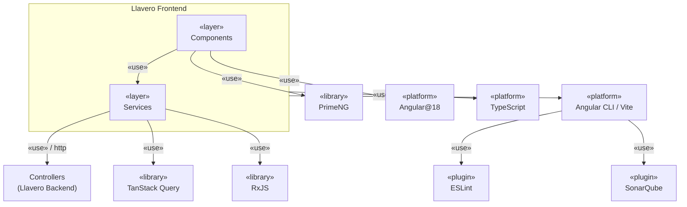

# 4.4 Diagrama de Componentes

## Backend

Mismas 5 capas ya definidas en `4.2 Diagrama de clases.md` (`Controllers` / `Services` / `Domains` / `Repositories` / `Models`), ahora mostrando de qué plataformas, librerías y herramientas depende cada una — no solo cómo se relacionan entre sí.

## Lectura del diagrama

- **`Controllers`** expone la API vía **Rest** (los router de Django Ninja) — es lo único que el frontend Angular consume, nunca las capas de más abajo directamente.
- **`Controllers`** usa **Pydantic** (los `schemas` de request/response que trae Django Ninja de fábrica) para validar entrada y forma de salida — es el equivalente funcional a Lombok en el ejemplo de referencia: reduce boilerplate, aquí de validación en vez de getters/setters.
- **`Services`** usa **Django Ninja** para las piezas de framework que necesita (inyección de request, manejo de excepciones) y resuelve el login federado con Office 365 sin la librería MSAL: intercambia el `code` de Microsoft con **httpx** (Authorization Code, confidential client, `AZURE_CLIENT_SECRET`), valida el `id_token` con **PyJWT** contra el JWKS del tenant, y emite el JWT propio con **`django-ninja-jwt`** (ver `back/auth/service.py`, `estrategia-migracion/backend.md`).
- **`Repositories`** es la única capa que toca **Django ORM** — ninguna otra capa importa el ORM directamente, ni siquiera `Models`.
- **`Models`** es lo único que conoce **PostgreSQL** en última instancia — vía el ORM, no con SQL directo en ningún otro punto del sistema.
- **`Poetry`** es la herramienta de empaquetado y dependencias (equivalente a Gradle en el ejemplo), con **SonarQube** (calidad de código) y **pytest-cov** (cobertura de tests, equivalente a Jacoco) como plugins de análisis — relevante porque el sistema arranca con TDD estricto desde el primer módulo (`estrategia-migracion/backend.md`), así que la cobertura real importa desde el día uno, no es un accesorio.

## Frontend

**Honesto con la arquitectura real**: Angular no tiene un split de 5 capas como el backend — no hay ORM ni base de datos local que justifique separar `Repositories`/`Models` del lado del cliente (`estrategia-migracion/frontend.md`: "página/componente + servicio de datos co-localizados"). Por eso aquí son 2 capas, no 5 — forzar una simetría artificial con el backend sería inventar estructura que no existe.

### Lectura del diagrama

- **`Components`** son las páginas/componentes Angular de cada feature (`4.3 Diagrama de Paquetes.md`) — usan **PrimeNG** para toda la UI y nunca llaman `TanStack Query`/`RxJS` directamente, eso vive en `Services`.
- **`Services`** concentra las llamadas HTTP (vía **TanStack Query**, que maneja cache/invalidación) y el estado reactivo con **RxJS**/signals — el login federado con Office 365 no necesita ninguna librería propia (sin MSAL Angular): `AuthService` solo redirige el navegador a `GET /api/auth/login` y canjea el código opaco que el backend deja en el redirect post-login vía `POST /api/auth/exchange`; todo el intercambio Authorization Code con Microsoft lo resuelve el backend (`front/src/app/core/auth/auth.service.ts`, `back/auth/service.py`).
- `Services` habla por **HTTP** con `Controllers` del backend (mismo componente ya mostrado arriba) — el frontend nunca se salta esa capa ni le habla a `Services`/`Repositories` del backend directamente.
- **`SonarQube`** es la misma herramienta de calidad del backend — analiza ambos proyectos, no es una instancia separada.
- **Framework de pruebas del frontend: pendiente de definir.** A diferencia del backend (TDD estricto con `pytest-cov` ya decidido), todavía no se ha elegido la herramienta de testing para Angular (Jasmine/Karma, Jest, o Vitest) — se deja explícito aquí para no dar por hecho una decisión que no se ha tomado.

---

[Volver](../README.md)
